inaugural edition of iron ctf (intrusion reconnaissance and offensive navigation ctf)!
team 1nf1n1ty from sastra deemed university invites all to embark on an exciting online jeopardy-style capture the flag challenge

## Random Pixels  [Forensics]

Solves: `141` Points: `375` Author: `OwlH4x`

Description: `My Image accidently fell into a pixel mixer can you help me recover it?`

we are provided with two files, an encrypted png image and python encryption script

```python
import random, time, numpy
from PIL import Image
from secret import FLAG

def randomize(img, seed):
	random.seed(seed)
	new_y = list(range(img.shape[0]))
	new_x = list(range(img.shape[1]))
	random.shuffle(new_y)
	random.shuffle(new_x)

	new = numpy.empty_like(img)
	for i, y in enumerate(new_y):
		for j, x in enumerate(new_x):
			new[i][j] = img[y][x]
	return numpy.array(new)


if __name__ == "__main__":
	with Image.open(FLAG) as f:
		img = numpy.array(f)
		out = randomize(img, int(time.time()))
		image = Image.fromarray(out)
		image.save("encrypted.png")
```
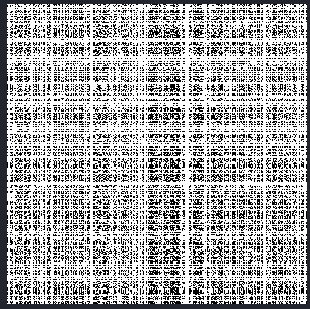

the decryption was done using the following python script. notice the fixed utc epoch seed extracted from `exiftool encrypted.png`'s modification time (file modification date/time     : 2024:10:02 22:02:40+01:00)
```python
import random, time, numpy
from PIL import Image

def randomize(img):
    random.seed(1727902960)
    old_y = list(range(img.shape[0]))
    old_x = list(range(img.shape[1]))
    
    random.shuffle(old_y)
    random.shuffle(old_x);print(old_y);print(old_x)
    new = numpy.empty_like(img)
    for i, y in enumerate(old_y):
        for j, x in enumerate(old_x):
            new[y][x] = img[i][j]
    return numpy.array(new)


if __name__ == "__main__":
    with Image.open('encrypted.png') as f:
        img = numpy.array(f)
        out = randomize(img)
        image = Image.fromarray(out)
        print(image)
        image.save("dec.png")
```
it decrypts the image and gets us a qr code which when is read gives the flag

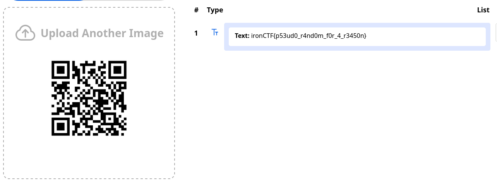

Flag: `ironCTF{p53ud0_r4nd0m_f0r_4_r3450n}`

## Game of Hunt [Forensics]

Solves: `113` Points: `420` Author: `tasarmays`

Description: `A Cryptic Voyage`

we are provided with a txt file with binary data in it. it can be decoded reversably since its name is upsidedown.txt

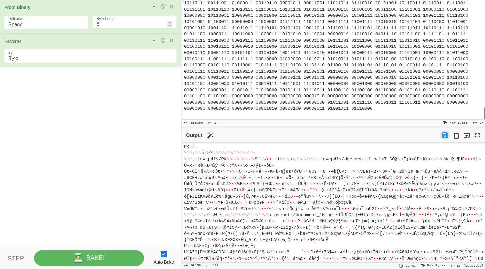

we get ilovepdfs.zip file containing multiple pdf files

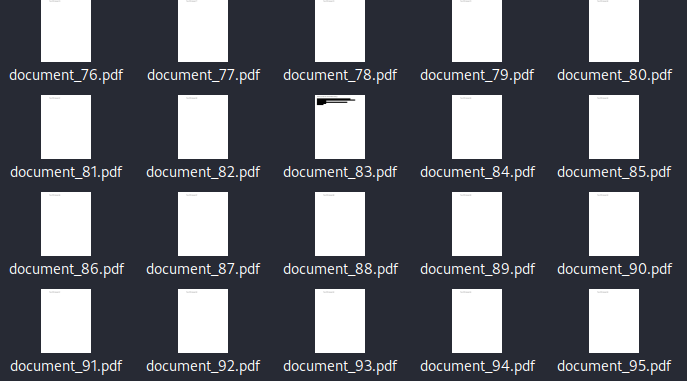

one particular pdf file has brainfuck message

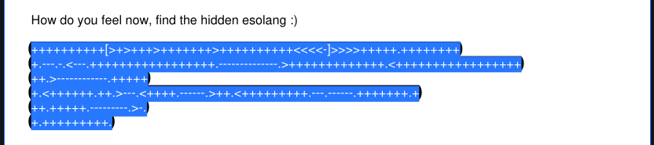

using dcode, it is readable and shows the flag

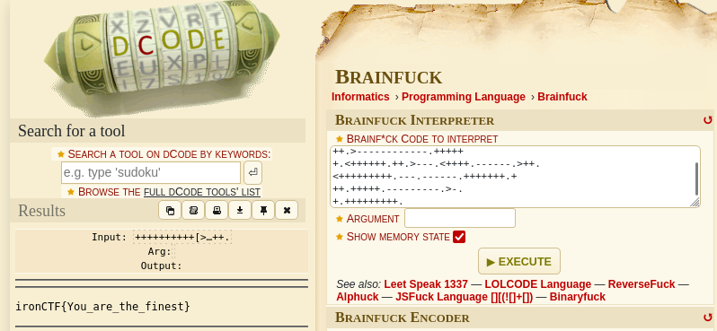

Flag: `ironCTF{You_are_the_finest}`

## Uncrackable Zip [Forensics]

Solves: `26` Points: `496` Author: `AbdulHaq`

Description: `I forgot to ask my friend for the password to access the secret webpage, and now he's unavailable. I've tried guessing the password, but it's been unsuccessful. My friend is very security-conscious, so he wouldn't use an easy-to-guess password. He's also an Emmet enthusiast who relies heavily on code generation shortcuts. Can you help me figure out how to access the secret webpage?`

this is a similar challenge to last ctf (buckeyectf), which takes into account the weak zip encryption method; zipcrypto store. this allows anyone to crack the zip using knwon plain bytes of the zipped file. using [bkcrack](https://github.com/kimci86/bkcrack), we get the keys of the zipfile provided by the challenge. we provide an index.html file having first bytes of a html file, `<!doctype html>` then zip it with same weak enc method then run bkcrack

```
bkcrack-1.7.0-Linux/bkcrack --cipher-zip ./website.zip --cipher-index 0 --plain-zip ./index.zip --plain-index 0
```
then we use those same keys to extract the index.html inside of website.zip

```
bkcrack-1.7.0-Linux/bkcrack -C website.zip -c index.html -k a18ba181 a00857dd d953d80f -d index1.html
```
flag is inside of html file

```
└─$ cat index1.html 
<!DOCTYPE html>
<html lang="en">
<head>
    <meta charset="UTF-8">
    <meta name="viewport" content="width=device-width, initial-scale=1.0">
    <title>Flag</title>
</head>
<body>
    ironCTF{Wh0_us35_Z1pCrypt0_wh3n_kn0wn_PlA1nt3xt_a7t4cks_ex1s7?}
</body>
</html>
```

Flag: `ironCTF{Wh0_us35_Z1pCrypt0_wh3n_kn0wn_PlA1nt3xt_a7t4cks_ex1s7?}`

## Fire in the Base Camp [Mobile]

Solves: `85` Points: `455` Author: `p3rplex3d`

Description: `I was playing with the dice when I heard about the fire in the base camp. Can you get there on time?`

we are provided with an apk file
```
└─$ file Fire_in_the_Base_Camp.apk 
Fire_in_the_Base_Camp.apk: Android package (APK), with gradle app-metadata.properties, with APK Signing Block
```
opening it in jadx-gui reveals a main activity

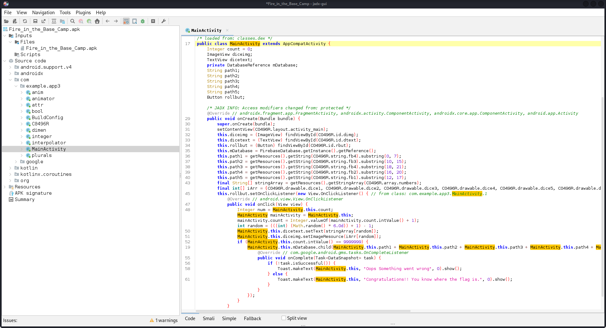

the app looks like this when installed on an emulator

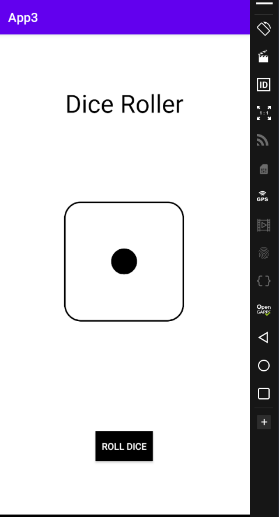

the source code shows that there is a firebase url that can be used for something, also some string variables are truncated then concatenated to construct the url. these values can be seen on strings.xml file

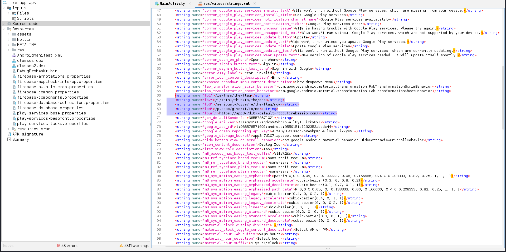

sending a request to the firebase url using the concatenated values retrieves parts of the flag
```
└─$ curl https://app3-7d107-default-rtdb.firebaseio.com/please/give/me/the/flag.json
{"f1":"ironCTF{","f2":"y0u_pu","f3":"7_0u7_t","f4":"h3_f1","f5":"r3_1n_t","f6":"h3_b4s","f7":"3_c4mp","f8":"_1f84a5","f9":"c66ff5}"}
```

Flag: `ironCTF{y0u_pu7_0u7_th3_f1r3_1n_th3_b4s3_c4mp_1f84a5c66ff5}`

## Secure Vault [Mobile]

Solves: `20` Points: `498` Author: `p3rplex3d`

Description: `Can you log in?`

we are provided with an apk file
```
└─$ file secure_vault.apk                                                                                                                   
secure_vault.apk: Android package (APK), with zipflinger virtual entry
```

i start by loading it in jadx-gui which reveals its a flutter app
using [blutter](https://github.com/worawit/blutter) i get a dart object pool
meanwhile, installing the app on an emulator and running it only shows this password scaffold

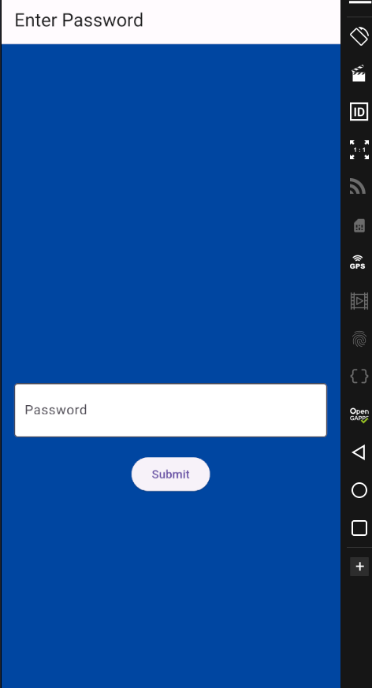

once blutter finished extracting dart objects, i immediatly inspect the dart files, only one is present (main.dart)

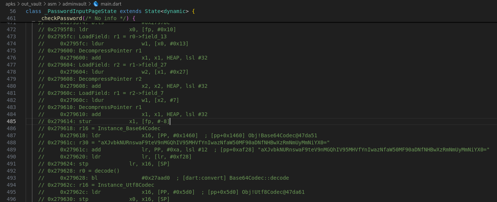

_checkpassword function reveals an encoded base64 value, when decoded it reveals the flag
```
└─$ echo "aXJvbkNURnswaF9teV9nMGQhIV95MHVfYnIwazNfaW50MF90aDNfNHBwXzRmNmUyMmNiYX0="|base64 -d
ironCTF{0h_my_g0d!!_y0u_br0k3_int0_th3_4pp_4f6e22cba}
```

Flag: `ironCTF{0h_my_g0d!!_y0u_br0k3_int0_th3_4pp_4f6e22cba}`

## Is this Android [Mobile]

Solves: `11` Points: `500` Author: `AbdulHaq & p3rplex3d`

Description: `I built this calculator for my Computer Science Project and my professor was baffled because there is more it than meet's the eye.`

we are provided with an apk file
```
└─$ file Calculator.apk 
Calculator.apk: Android package (APK), with zipflinger virtual entry
```
upon installation on genymotion rooted emulator, we get a calculcator application which weirdly doesnt function properly and prints always error!

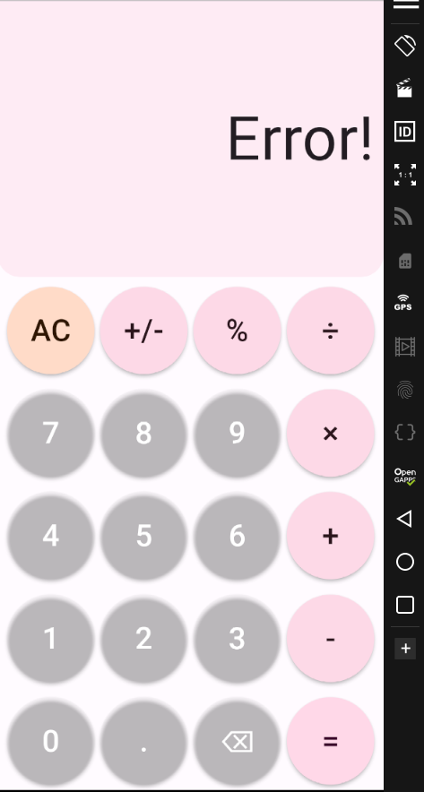

again, since this is a flutter app we can use [blutter](https://github.com/worawit/blutter) to get information from libapp.so
while checking the dart objects strings pp.txt, i stumble across a url used in the app

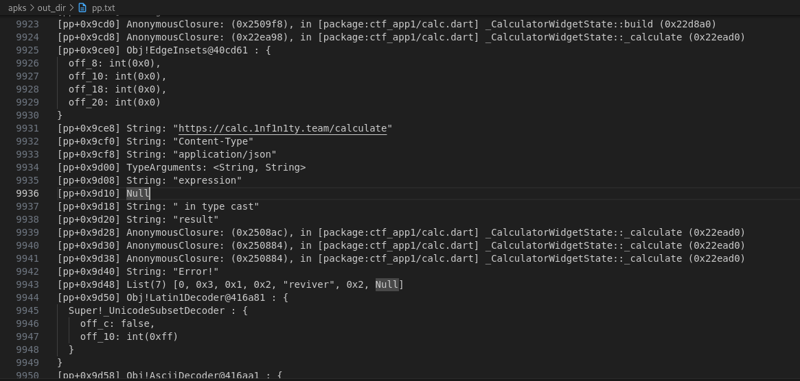

also by checking calc.dart file

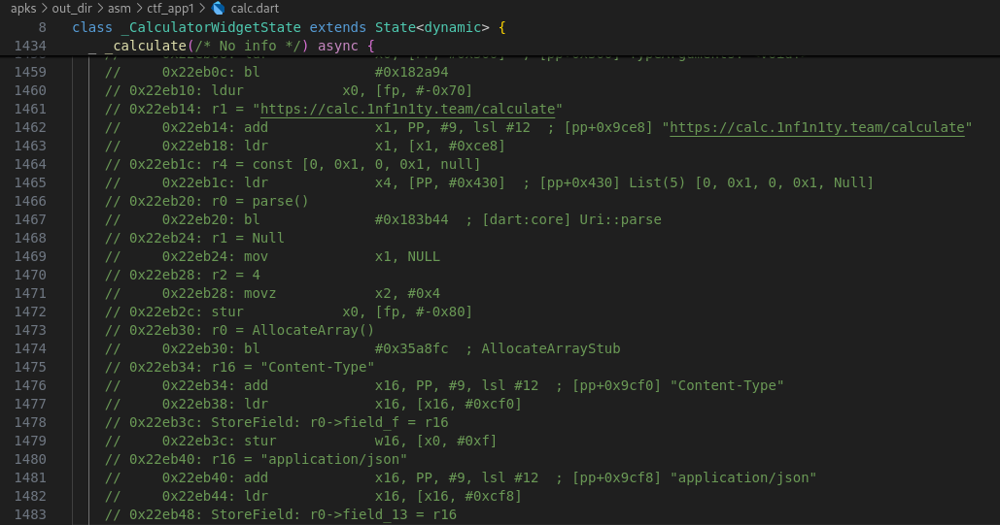

it it confirmed that there is a post request sent to https://calc.1nf1n1ty.team/calculate 

i fire up burp proxy and launch first a get request which returns a python file path

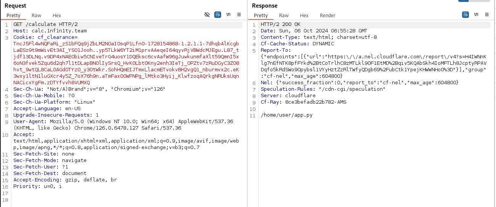

i make use of the _calculate function in calc.dart and launch this time a post request with a mathematecal expression

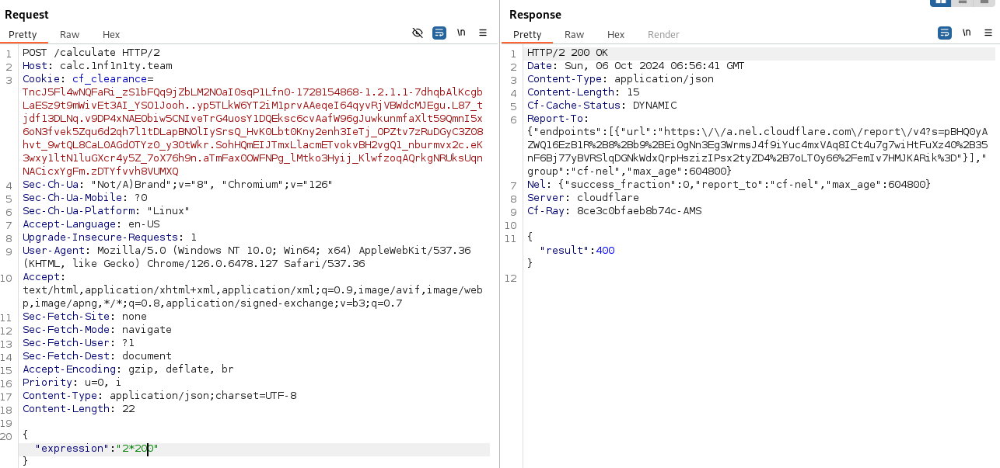

we get the correct result, now, at this point, my theory was to somehow achieve remote code execution since this is the only lead i got, so i tried several ssti payloads and some other command injection payloads. they didnt work, so i changed my approach, since this is probably a python web application which is hinting towards reading that source code of app.py, i was able to know that open() function is functional and it needs a file path argument

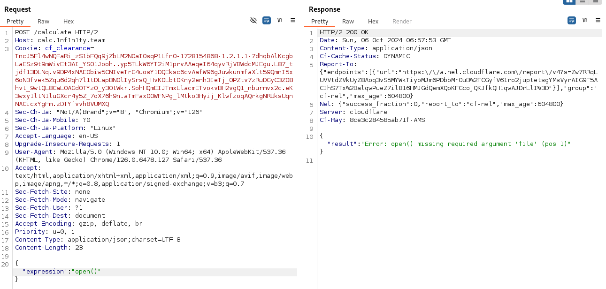

at this point, i also tried to do a simple open(\`/home/user/app.py\`) and other variations but somehow nothing worked, as the word app and other chars were blacklisted, but there was a workaround which is using pythons chr to get charcode back to text. so i prepared the payload and sent it

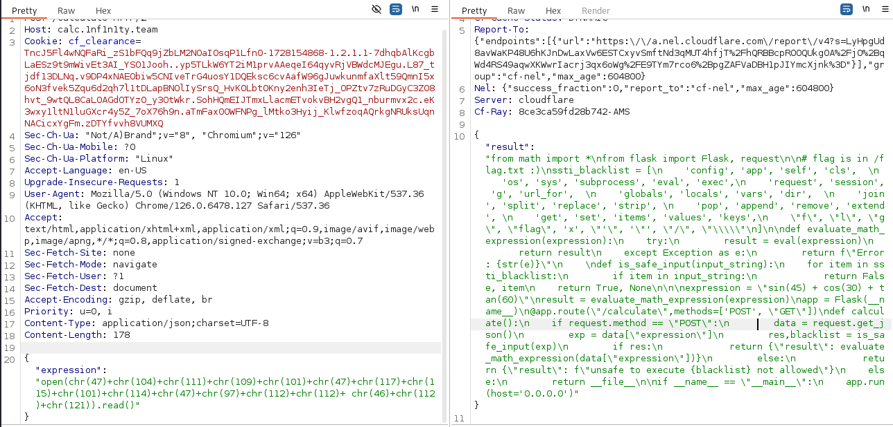

we are able to read the source code and the flag is in /flag, i repeat the previous step and get the flag!

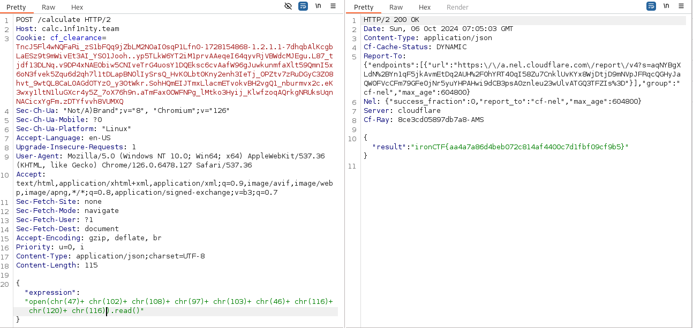

Flag: `ironCTF{aa4a7a86d4beb072c814af4400c7d1fbf09cf9b5}`

## Mango [Web, Warmup]

Solves: `81` Points: `460` Author: `Vigneswar`

Description: `Mangoes are good for health! do you know what else are good for health? well, checkWarmup my website about nutritious fruits!.`

this is a web warmup challenge, where it insinuates towards nosql exploitation. first, heading into the web app reveals a fruits list and a login page

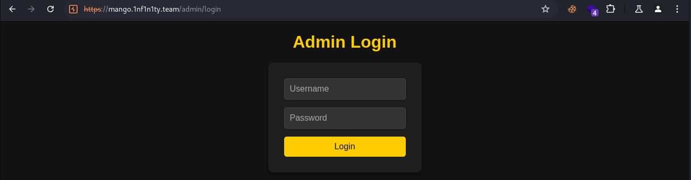

since this is about mango, which can be interpreted into having mongodb as a database system. a special nosql payload can be prepared to take advantge of weak checks on the backend system

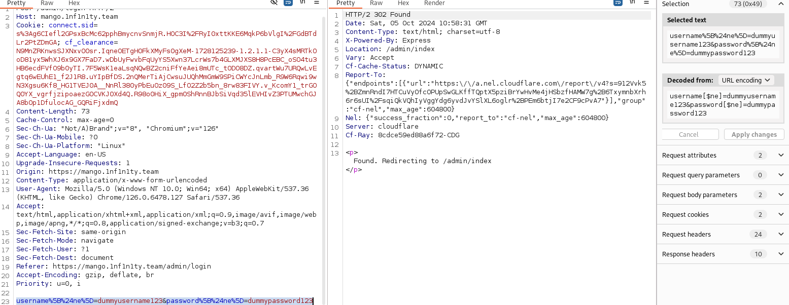

running the url encoded payload  bypasses successfully the login page and reveals the flag

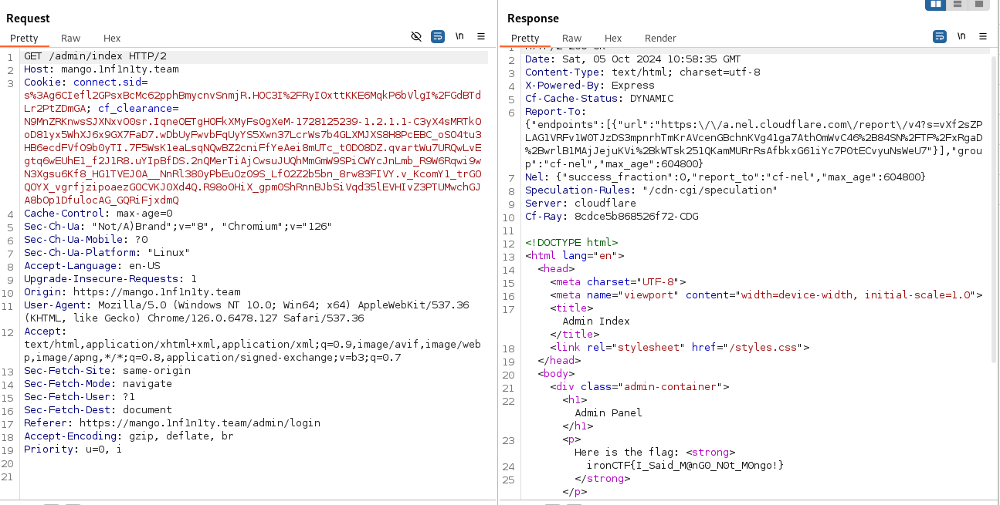

Flag: `ironCTF{I_Said_M@nG0_N0t_M0ngo!}`

## JWT Hunt [Web, Warmup]

Solves: `92` Points: `448` Author: `BY73 B4ND17`

Description: `Scavenger hunts are a blast, so I've woven one into this challenge. Test your skills and see if you can uncover the treasure you seek!`

this is a web warmup challenge which hints towards getting admin access via jwt forging using the secret_key. first by registering and loggin in to the dashboard, it welcomes us that the flag isnt here

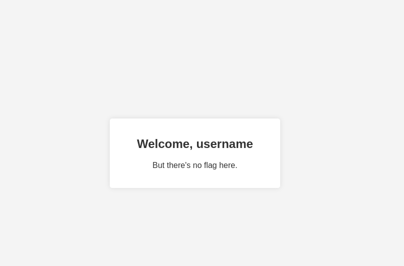

so, the hunt for secret_key starts. we start by checking the famous robots.txt file and get the 1st part with the 2nd part being in cookie. it also hints towards fourth flag being in the disallowed path

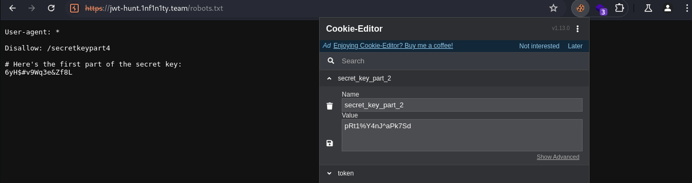

doing verb tampering on the disallowed path via the head http verb returns the 4th part of secret_key. now we only need the 3rd part

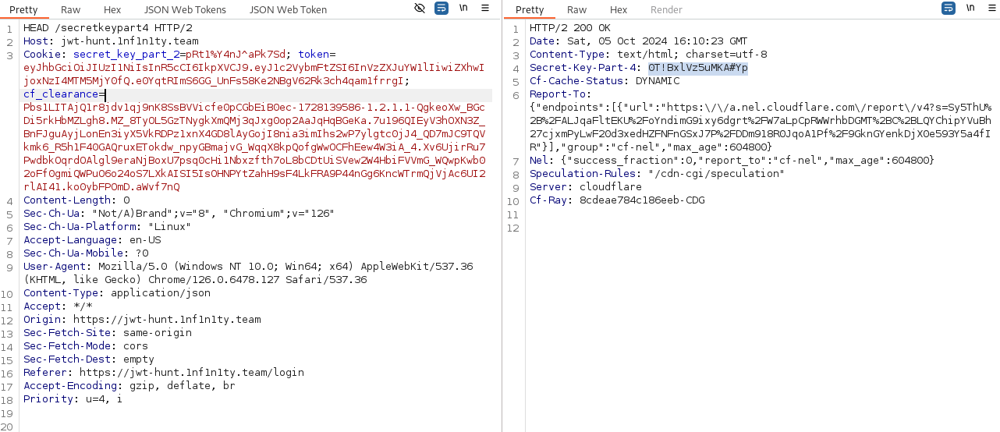

a well known xml file for more efficient crawling returns the 3rd part

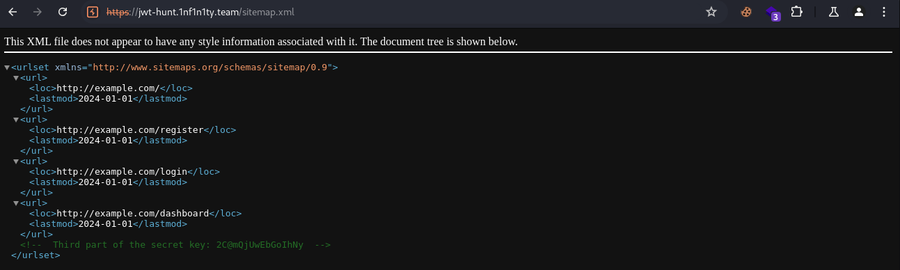

now, by tampering with the logged on jwt token using online jwt tools like [jwt.io](https://jwt.io/) by providing the full sercet key `6yh$#v9wq3e&zf8lprt1%y4nj^apk7sd2c@mqjuwebgoihny0t!bxlvz5umka#yp` and changing username to admin, and finally refreshing the page reveals the flag

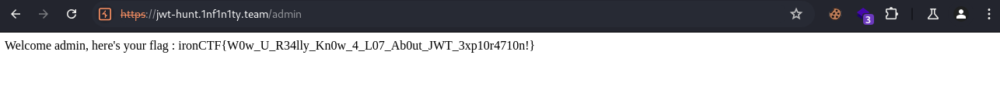


Flag: `ironCTF{W0w_U_R34lly_Kn0w_4_L07_Ab0ut_JWT_3xp10r4710n!}`

## Treasure Hunt [Mobile, Warmup]

Solves: `39` Points: `491` Author: `p3rplex3d`

Description: `I like colors and solving puzzles. What is better than having an app that brings both of them together?`

we are provided with an apk file. opening it on jadx-gui reveals several things. first, the application is started on first activity, which doesnt help

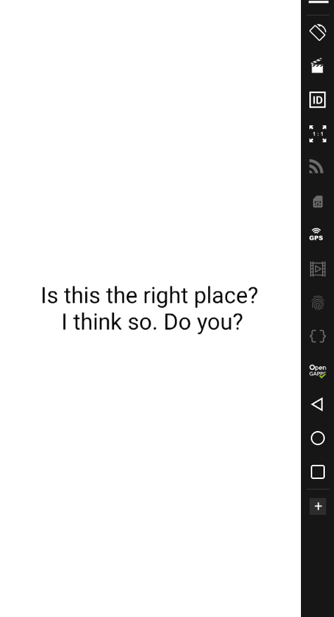

second, the main activity has got a first part of flag in layout xml file

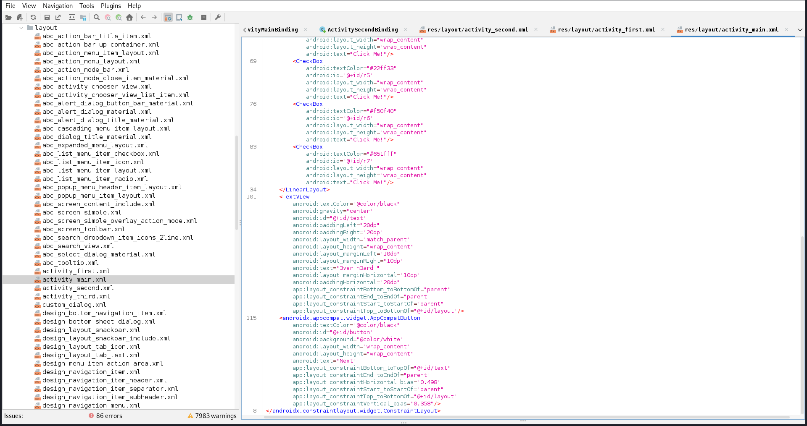

the second part is in strings xml file for the second activity/screen

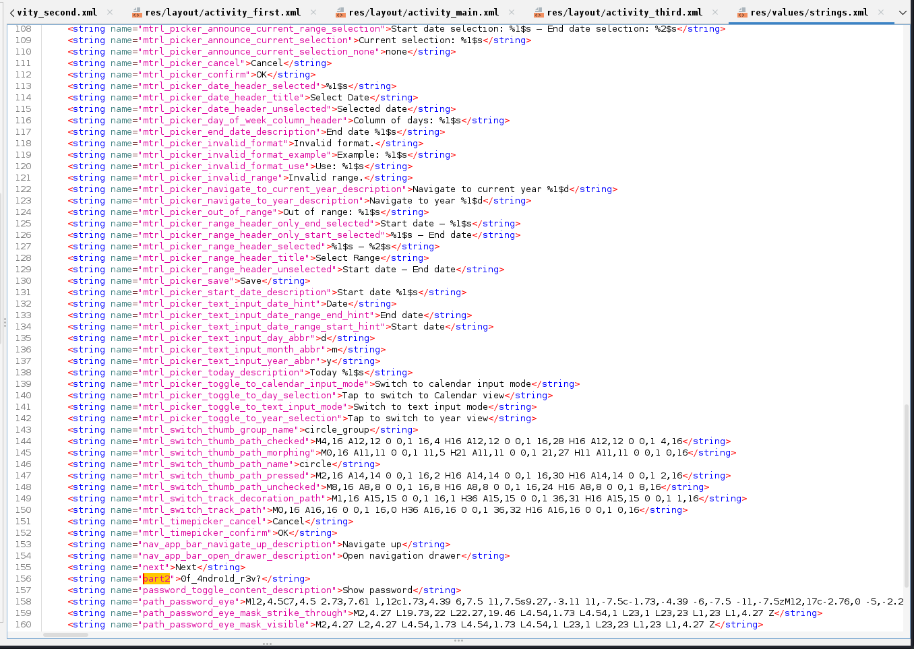

combining the two parts constructs the flag

Flag: `ironCTF{3ver_h3ard_0f_4ndro1d_r3v?}`